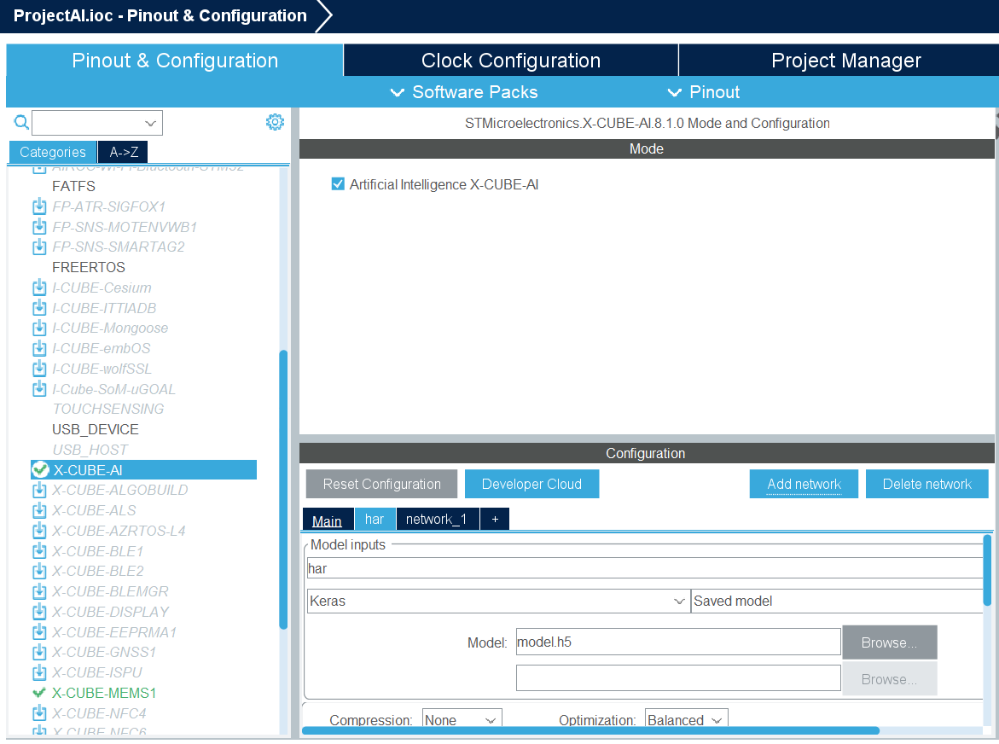
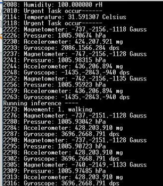
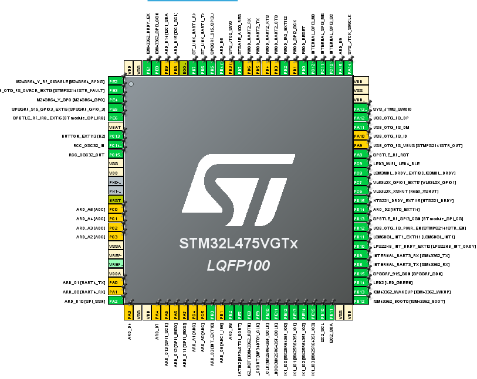
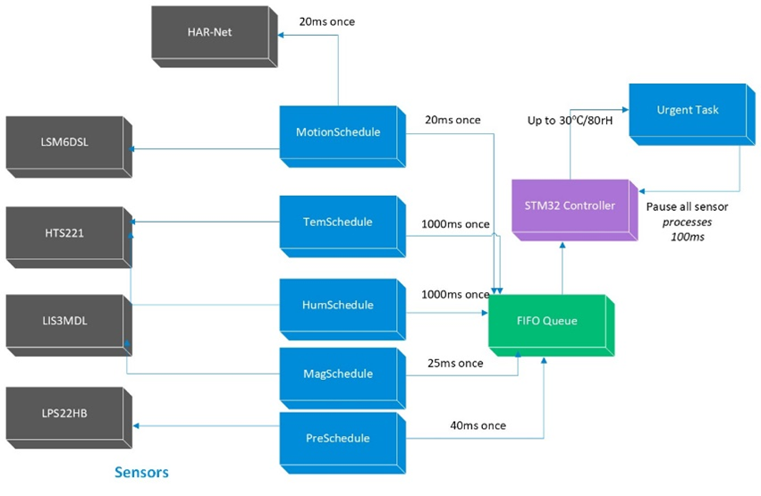

# Motion Perception and Sensor Polling Scheduling Original System

[Har-net](https://ieeexplore.ieee.org/document/8931260) is a learning model for the Single-Stage Object Detection. in this system, we use Har-net for motion detection and perception in STM32. By the way, the polling of the sensor ODR by FCFS scheduling are deployed with a FCFS scheduling in real time.

To load this system, you should have a STM32 development kit (B-L475E-IOT01A). The proper IDE to be advised is STM32CubeIDE. 

## Load and Usage

First, open the system file .project. 

And then bind the location of the model file of HAR-net, in the Configuration of "X-CUBE-AI" as follow:

Click the icon of "Debug as" and "Run" with connecting a STM32 board.

Download and open the software "Tera Term 5", setting the Serial port to the speed of 115200 and the data of 8 bits. 

Now you can see the output of the system if you have configured the settings properly as follow. 

And the prediction will change if the board is in a different motion speed.

## Design

The pins of the development board are set as follows. You can see and modify it in the [ProjectAI.ioc file](ProjectAI.ioc). 

In our system, real-time is the prime consideration. We use a method of polling the jobs in the job list with an unpreemptive FCFS. We set a special interval for each job, and the job will be scheduled if its running time comes. Our job list of the six sensors and the HAR-Net is as below:

| Task           | Function                          | Running  Interval |
| -------------- | --------------------------------- | ----------------- |
| MotionSchedule | Read  motion data and use HAR-Net | 20 ms             |
| TemSchedule    | Read temperature                  | 1000 ms           |
| HumSchedule    | Read Humidity                     | 1000 ms           |
| MagSchedule    | Read magnetic                     | 25  ms            |
| PreSchedule    | Read pressure data                | 40  ms            |

The workflow of the scheduler is as the following figure shows:

Since the HAR-Net has dependencies on the value from the sensor LSM6DSL, we put the scheduling of it after the schedule of reading LSM6DSL. 

Additionally, the size of the data that can be calculated in HAR-Net needs to go beyond 3*26. Since in one polling, we can get 3 values of Accelerometer. Therefore we are supposed to set the minor cycle to be 26 in the cyclic scheduler, which means that the HAR-Net will be scheduled once in 26 times of the task "MotionSchedule".

We also design external task that may happened in our system, which represents that something happened break the original scheduling. In our design, when the temperature go beyond 30 ℃ or the humidity go beyond 80 rH, there will be an urgent task occurring.
